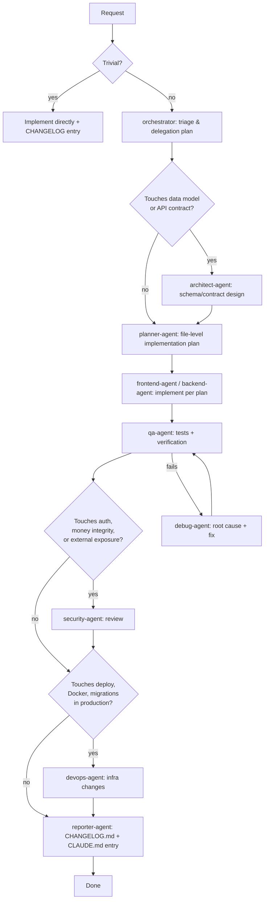

# Workflow

How a request moves from "someone said something" to "shipped and documented." This defines the
**default pipeline** for non-trivial changes and the **fast path** for trivial ones.

## Important: Who Actually Invokes Agents

Only the top-level Claude Code session (the one talking to the user) can invoke subagents — a
subagent cannot spawn another subagent. So "orchestrator" below describes a *role*: either the
top-level session performs it directly, or it invokes the `orchestrator` subagent to get a
delegation plan back as a recommendation, then the top-level session carries that plan out by
invoking each specialist agent in turn. See `AGENT_COMMUNICATION.md §1` for why this matters.

## Default Pipeline

## Step-by-Step

1. **Triage** (`orchestrator`): classify the request — trivial vs. pipeline, which specialist
   agents are actually needed (not every change needs every step; e.g. a copy fix skips
   architect/security/devops entirely).
2. **Design** (`architect-agent`, only if the data model or an API contract changes): produces a
   short decision record — what changes, why, migration shape, and whether it's additive
   (default) or needs explicit human sign-off (destructive).
3. **Plan** (`planner-agent`): turns the request (+ architect's design, if any) into a concrete,
   file-level plan: which files change, in what order, what tests are needed. This is what
   `frontend-agent`/`backend-agent` actually execute against.
4. **Implement** (`frontend-agent`, `backend-agent`): executes the plan, following
   `CODING_STANDARD.md`. These two can run in parallel when the plan cleanly separates UI from API
   work; sequentially when the frontend depends on a new API shape.
5. **Verify** (`qa-agent`): runs/extends tests per `TESTING_STANDARD.md`, confirms acceptance
   criteria from the original request (or `ROADMAP.md` item) are met. On failure, hands off to
   `debug-agent`, not back to the implementer blind — debug-agent's job is root-causing first.
6. **Security review** (`security-agent`, conditional): required whenever the change touches auth,
   session handling, an endpoint's access control, or anything that could affect financial-record
   integrity or audit-trail completeness. Skipped for pure UI styling or read-only report changes.
7. **Infra** (`devops-agent`, conditional): required when the change needs a migration applied in a
   real environment, a Docker/Compose change, or anything in `DEPLOYMENT.md`.
8. **Report** (`reporter-agent`): writes the `CHANGELOG.md` entry and the condensed `CLAUDE.md §8`
   row. A change isn't done until this step lands — see `PROJECT_RULES.md §3`.

## Fast Path (Trivial Changes)

Typo fixes, copy edits, dependency patch bumps with no behavior change, doc-only edits: implement
directly, skip the pipeline, still add a `CHANGELOG.md` line if the change touches a tracked file
non-doc file. Judgment call on "trivial" belongs to whoever's doing the triage — when unsure,
default to the full pipeline rather than skipping steps on something that turns out to matter.

## Escalation

At any step, if `PROJECT_RULES.md §4` applies (constraint violation risk, destructive migration,
scope ambiguity, exposure beyond LAN, blast radius beyond the local repo), stop the pipeline and
surface the question to the user instead of proceeding on a guess.
